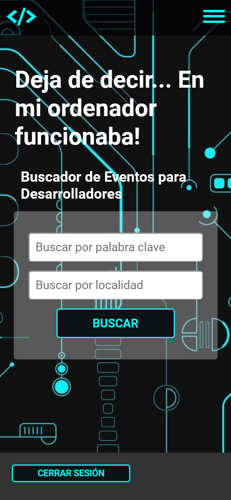
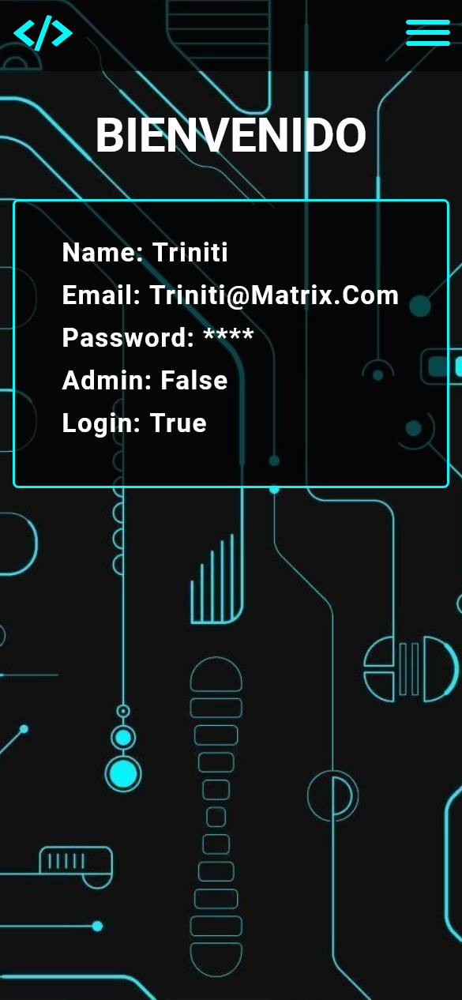
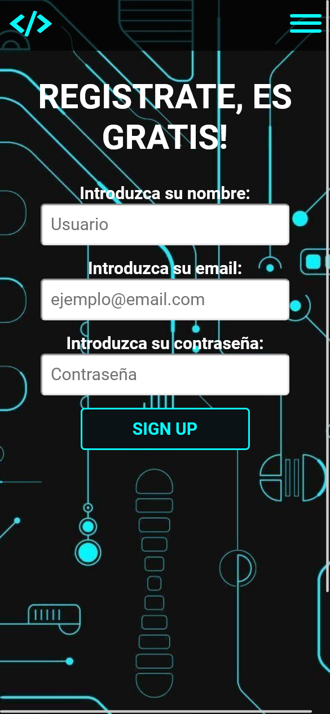
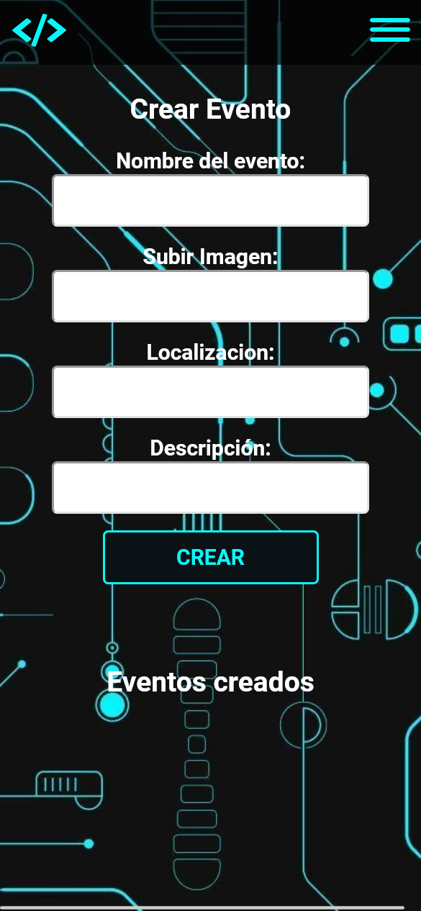

# Evento de Programación
Hemos desarrollado este proyecto de forma grupal, poniendo en práctica nuestros conocimientos tanto de Front-end como de Back-end. El objetivo era crear un aplicacion web 
con bases de datos tanto relacionales como no relacionales, renderizando los datos a traves de un motor de plantillas, con todo eso, nuestro proyecto se basa en crear un buscador de eventos
tecnológicos.
## Instalación
En primer lugar clonar este repositorio. Instala las dependencias ("npm i")
Añade las credenciales con el siguiente formato al archivo .env:
PG_USER=
PG_HOST=
PG_DATABASE=
PG_PASSWORD=
MG_PASSWORD=
CLIENT_ID=
CLIENT_SECRET=
JWT_SECRET=
Ejecuta "npm run dev" para lanzar el servidor.
## Objetivos
- Mobile First
- Bases de datos relacionales y no relacionales (PG / Mongo DB ATlas)
- Scrapping (Puppeteer)
- Autenticación (Passport/JWT)
- Motor de plantillas (Pug)
- Tests unitarios (Jest/Supertest)
- Gestion de ficheros
- Gestion de versiones
## Tecnologías utilizadas
Hemos utilizado tecnologias como HTML5, CSS3, JavaScript, Express, SQL y Mongo.
## Screenshots

## Links
[View on Render](https://eventos-programacion.onrender.com/)
